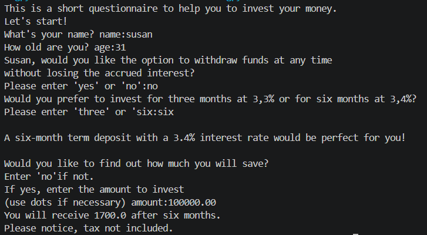

# dynamic-questionnaire-application-developed-in-python
dynamic questionnaire application for financial decisions

This is a questionnaire based on my own idea to present a way to help you to make decision by investing your money. There are several questions. Each answer appropriately personalizes the next question. Even no answer or a not valid answer is included during questionnaire action. I’ve presented a loop for entering the age, as this is key information. In some cases, failure to provide the appropriate response results in the survey being terminated, with notification to that effect. During the presentation, I did not focus on the currency, but on the values. Tax issues are not taken into account.
The process relies on two interconnected files; I used an import here.

Please find below some samples of questions and answers.

example 1

## 
